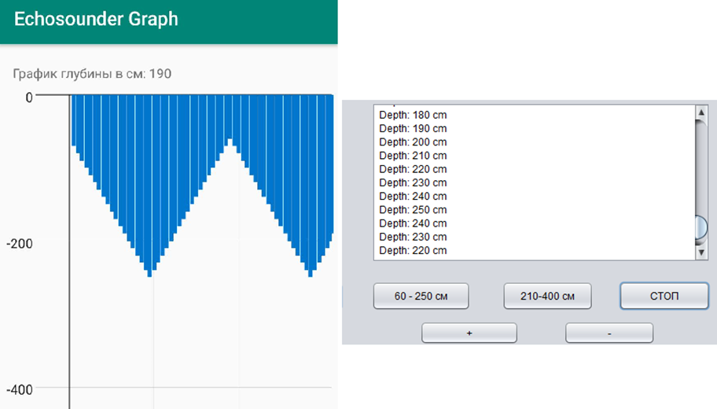

# Описание

**_Приложение Андроид для визуализации данных от эхолота о глубине водоема (TCP клиент)_**

Для приема и визуализации данных о глубине водоема используется приложение на Андроид. Приложение принимает данные посредством TCP, в данном случае данные приходят от клиента (эхолота).
Полученные данные глубины должны выводиться на экран в виде графика характеризующего профиль дна. Приложение разработано в среде Android Studio.

### 🖼️ Результат симуляции приложения

